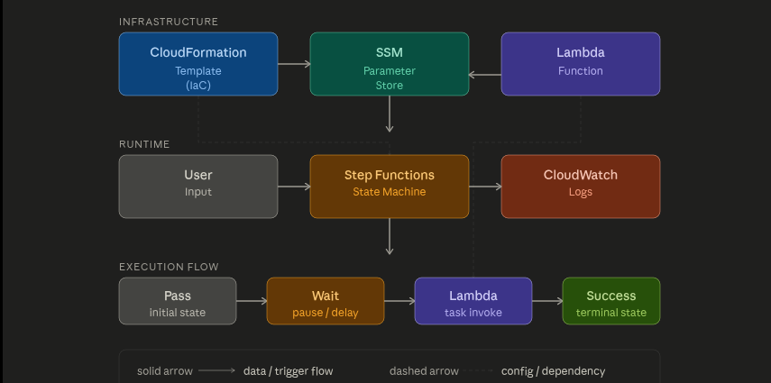
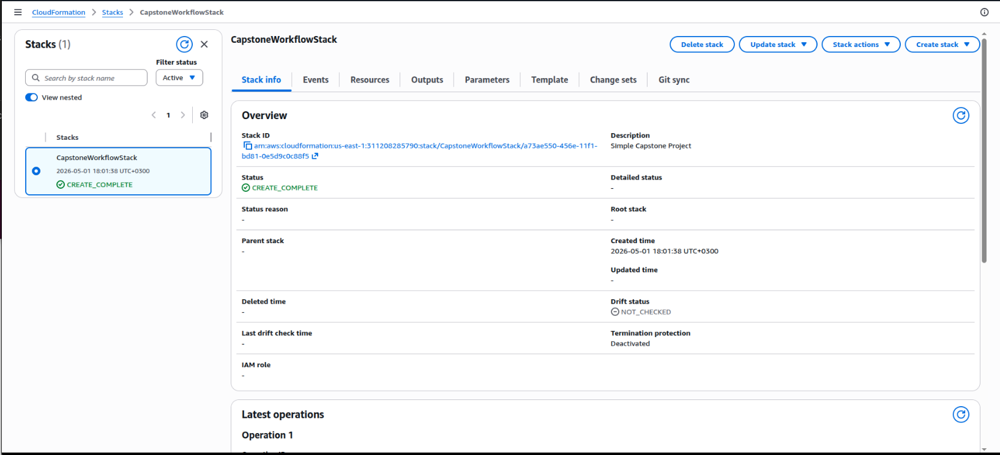
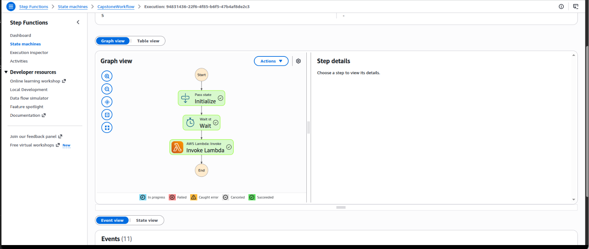
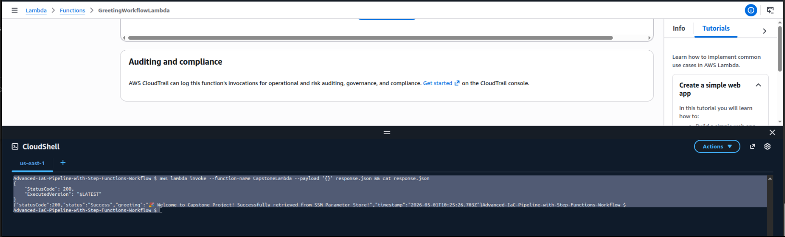
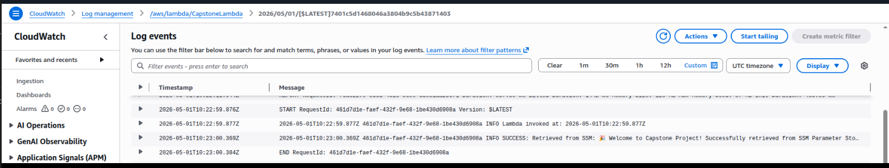

# Advanced Infrastructure as Code Pipeline with Step Functions Workflow

[](https://aws.amazon.com/cloudformation/)
[](https://aws.amazon.com/lambda/)
[](https://aws.amazon.com/step-functions/)

## Table of Contents
- [Project Overview](#project-overview)
- [Architecture](#architecture)
- [Prerequisites](#prerequisites)
- [Deployment Guide](#deployment-guide)
- [Testing the Workflow](#testing-the-workflow)
- [Monitoring & Observability](#monitoring--observability)
- [Clean Up](#clean-up)
- [Troubleshooting](#troubleshooting)
- [Screenshots](#screenshots)

## Project Overview

This capstone project demonstrates **advanced Infrastructure as Code (IaC)** practices using AWS CloudFormation to deploy a fully automated serverless workflow. The solution showcases:

- **Infrastructure as Code** - Complete AWS infrastructure defined in YAML
- **Configuration Management** - Dynamic configuration with SSM Parameter Store
- **Workflow Orchestration** - Multi-step state machine with error handling
- **Serverless Compute** - Lambda functions with proper IAM roles
- **CI/CD Automation** - Automated deployment pipeline with CodePipeline
- **Observability** - CloudWatch logging and monitoring dashboard

## Project Structure

Advanced-IaC-Pipeline-with-Step-Functions-Workflow/
│
├── lambda/
│   └── index.js
│
├── screenshots/         
│   ├── cloudformation-deploy.png
│   ├── lambda-cloudwatch-logs.png
│   └── stepfunctions-graph.png
│
├── template.yaml │
└── README.md            

## Architecture




### Workflow States

| State | Type | Purpose |
|-------|------|---------|
| **Initialize Workflow** | Pass | Captures execution metadata |
| **Wait for Processing** | Wait | 2-second delay simulation |
| **Invoke Greeting Lambda** | Task | Executes Lambda with retry logic |
| **Workflow Completed** | Pass | Success terminal state |
| **Workflow Failed** | Fail | Error handling state |

## Prerequisites

| Requirement | Version | Verification Command |
|-------------|---------|---------------------|
| AWS Account | Active | - |
| AWS CLI | Latest | `aws --version` |
| Git | 2.x+ | `git --version` |

## Deployment Guide

### Step 1: Set up GitHub OAuth Token

Create a GitHub OAuth token for CodePipeline access:

1. Go to GitHub Settings → Developer settings → Personal access tokens
2. Generate a new token with `repo` scope
3. Store the token in SSM Parameter Store:

```bash
aws ssm put-parameter \
  --name /github/oauth-token \
  --value YOUR_GITHUB_TOKEN \
  --type SecureString
```

### Step 2: Deploy via AWS CloudShell

Open AWS CloudShell

Upload the template.yaml file

Run deployment command:

bash
aws cloudformation deploy \
  --stack-name CapstoneWorkflowStack \
  --template-file template.yaml \
  --capabilities CAPABILITY_IAM \
  --parameter-overrides ProjectName=Capstone Environment=prod GitHubOwner=YOUR_GITHUB_USERNAME GitHubRepo=Advanced-IaC-Pipeline-with-Step-Functions-Workflow GitHubBranch=main
### Step 3: Verify Deployment and CI/CD Pipeline
bash
# Check stack status
aws cloudformation describe-stacks \
  --stack-name CapstoneWorkflowStack \
  --query "Stacks[0].StackStatus"

# View pipeline status
aws codepipeline get-pipeline-state \
  --name Capstone-Pipeline-prod

# View outputs
aws cloudformation describe-stacks \
  --stack-name CapstoneWorkflowStack \
  --query "Stacks[0].Outputs"
    Testing the Workflow
Test Lambda Function
bash
# Get Lambda name from outputs
LAMBDA_NAME=$(aws cloudformation describe-stacks \
  --stack-name CapstoneWorkflowStack \
  --query "Stacks[0].Outputs[?OutputKey=='LambdaFunctionName'].OutputValue" \
  --output text)

# Invoke Lambda
aws lambda invoke \
  --function-name $LAMBDA_NAME \
  --payload '{}' \
  response.json && cat response.json
Expected Output:

json
{
  "statusCode": 200,
  "status": "Success",
  "greeting": "Welcome to Advanced IaC Pipeline! Successfully retrieved from SSM Parameter Store!",
  "inputMessage": "No additional message provided",
  "timestamp": "2026-05-01T...",
  "ssmParameter": "/app/config/greeting"
}

## Monitoring & Observability

This project includes comprehensive monitoring through CloudWatch:

- **CloudWatch Logs**: All Lambda functions and Step Functions executions are logged
- **CloudWatch Dashboard**: Pre-configured dashboard for monitoring Lambda invocations and performance
- **X-Ray Tracing**: Enabled for Step Functions and Lambda for distributed tracing

Access the monitoring dashboard at: [CloudWatch Dashboard](https://console.aws.amazon.com/cloudwatch/home?region=us-east-1#dashboards:name=AdvancedIaC-Monitoring-dev)


## Troubleshooting

### Common Issues

1. **SSM Parameter Access Denied**
   - Ensure the Lambda execution role has `ssm:GetParameter` permission
   - Verify the parameter path `/app/config/greeting` exists

2. **Step Functions Execution Fails**
   - Check CloudWatch Logs for the state machine
   - Verify Lambda function is deployed and accessible

3. **CloudFormation Deployment Fails**
   - Check IAM permissions for CloudFormation
   - Ensure CAPABILITY_IAM is specified during deployment

## Screenshots


#### 1. CloudFormation Stack (CREATE_COMPLETE)


*Figure 1: CodePipeline showing successful build and deploy stages*

### Step Functions Execution Graph


*Figure 2: Visual graph of successful Step Functions execution*

#### 2. Lambda Function Output


### CloudWatch Logs - Lambda SSM Retrieval


*Figure 3: CloudWatch logs showing Lambda successfully retrieving value from SSM Parameter Store*


